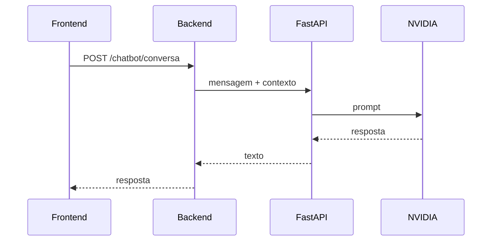

# SI - IA

Chatbot do CRM. FastAPI + NVIDIA API.

**Repositório:** [github.com/guilhermemarch/si_ia](https://github.com/guilhermemarch/si_ia)

## Repositórios relacionados

| Serviço | Repositório |
|---------|-------------|
| Frontend | [github.com/guilhermemarch/si_frontend](https://github.com/guilhermemarch/si_frontend) |
| Backend | [github.com/guilhermemarch/si_backend](https://github.com/guilhermemarch/si_backend) |
| IA | [github.com/guilhermemarch/si_ia](https://github.com/guilhermemarch/si_ia) |

Não acessa banco de dados. O backend envia contexto (leads, imóveis, resumo) e este serviço devolve a resposta.

## Fluxo



## Configuração

```bash
cp .env.example .env
```

```env
NVIDIA_API_KEY=
NVIDIA_MODEL=google/gemma-4-31b-it
PORT=8000
```

Sem `NVIDIA_API_KEY`, o serviço sobe mas o chat avisa que a chave não foi configurada.

## Rodar

```bash
python3 -m venv .venv
source .venv/bin/activate
pip install -r requirements.txt
uvicorn app.main:app --reload --port 8000
```

## Rotas

| Método | Rota | Descrição |
|--------|------|-----------|
| GET | `/saude` | Health check |
| POST | `/chat/conversa` | Mensagem + contexto |

## Docker

```bash
docker build -t si-ia .
docker run --env-file .env -p 8000:8000 si-ia
```
